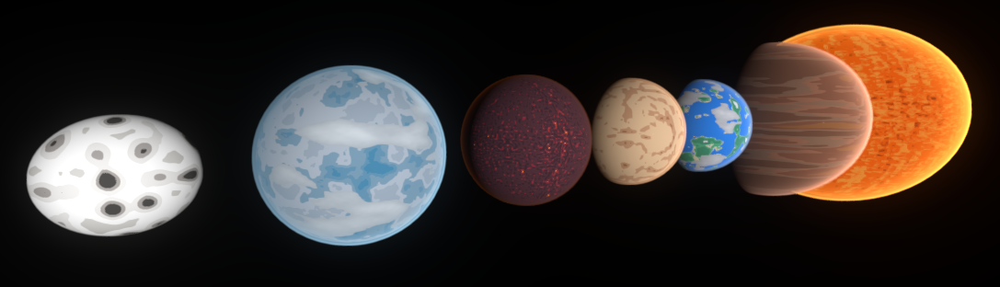
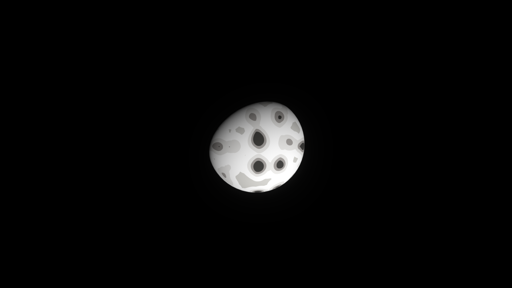
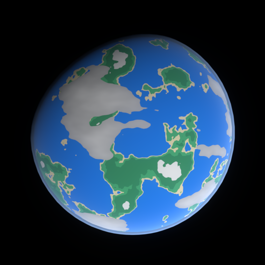
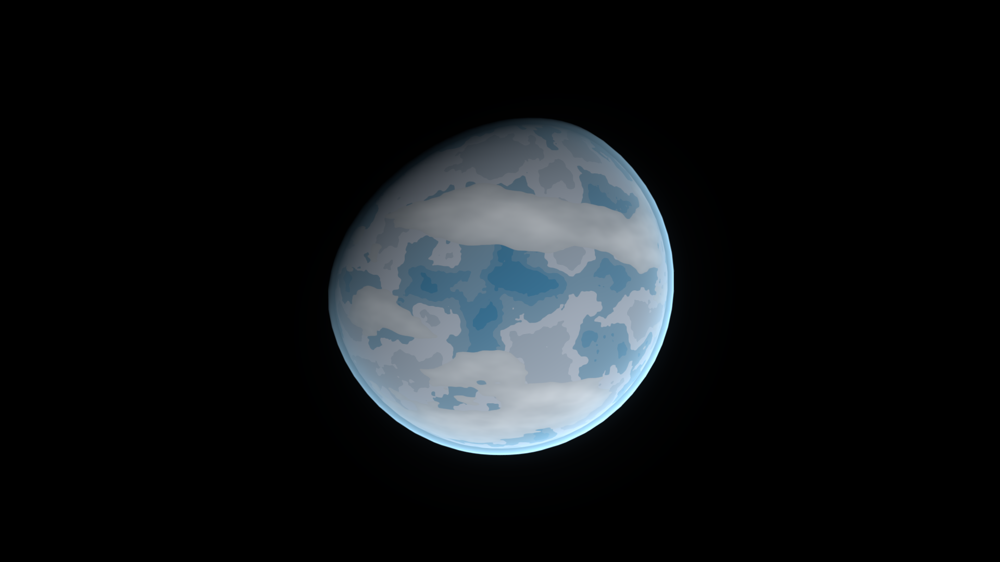
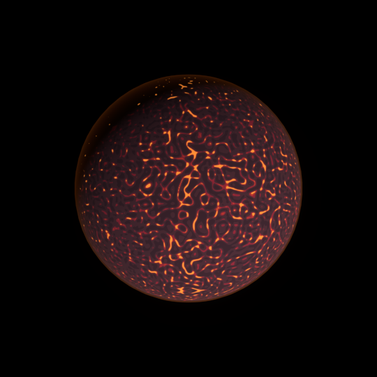
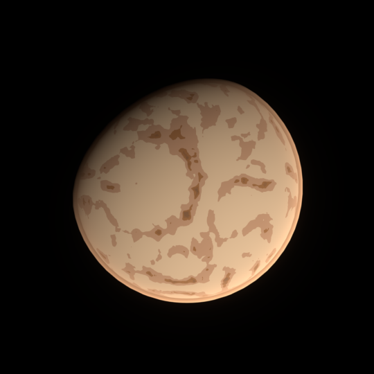
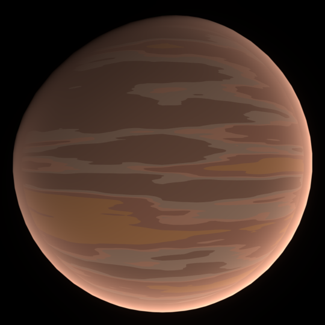
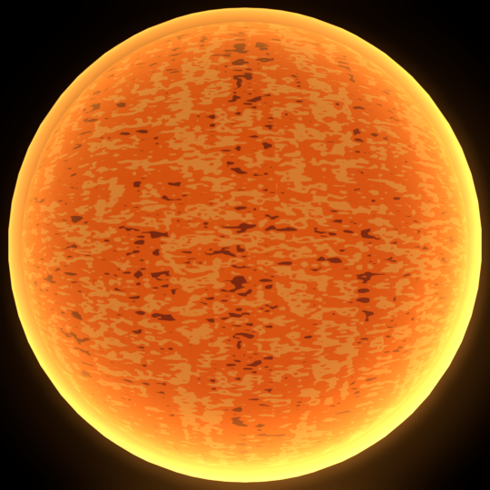

# Godot 3D Planet Generator

## About

Three shaders to generate 3D animated planets and stars in Godot 4:

- Planet body generation shader
- Cloud generation shader
- Astmosphere generation shader

The project contains seven example planets:

- No atmosphere planet
- Terrestrial planet
- Ice planet
- Lava planet
- Sand planet
- Gaseous planet
- Star

 **FAQ and more information: [https://naejimer.itch.io/godot-3d-planet-generator](https://naejimer.itch.io/godot-3d-planet-generator)**

## Screenshots

